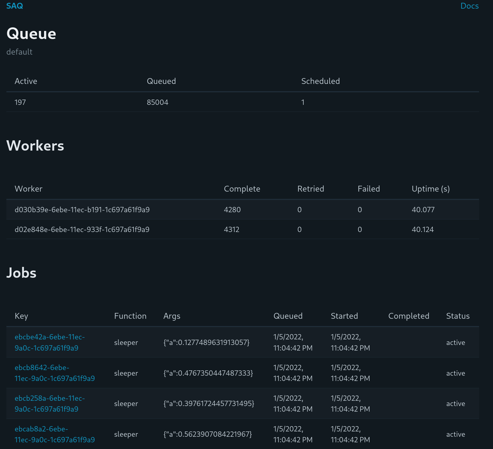

# SAQ
SAQ (Simple Async Queue) is a simple and performant job queueing framework built on top of asyncio and redis. It can be used for processing background jobs with workers. For example, you could use SAQ to schedule emails, execute long queries, or do expensive data analysis.

[Documentation](https://saq-py.readthedocs.io/)

It uses [redis-py](https://github.com/redis/redis-py) >= 4.2.

It is similar to [RQ](https://github.com/rq/rq) and heavily inspired by [ARQ](https://github.com/samuelcolvin/arq). Unlike RQ, it is async and thus [significantly faster](benchmarks) if your jobs are async. Even if they are not, SAQ is still considerably faster due to lower overhead.

SAQ optionally comes with a simple UI for monitor workers and jobs.



## Install
```
# minimal install
pip install saq

# web + hiredis
pip install saq[web,hiredis]
```

## Usage
```
usage: saq [-h] [--workers WORKERS] [--verbose] [--web]
           [--extra-web-settings EXTRA_WEB_SETTINGS]
           [--port PORT] [--check]
           settings

Start Simple Async Queue Worker

positional arguments:
  settings              Namespaced variable containing
                        worker settings eg: eg
                        module_a.settings

options:
  -h, --help            show this help message and exit
  --workers WORKERS     Number of worker processes
  --verbose, -v         Logging level: 0: ERROR, 1: INFO,
                        2: DEBUG
  --web                 Start web app. By default, this
                        only monitors the current
                        worker's queue. To monitor
                        multiple queues, see '--extra-
                        web-settings'
  --extra-web-settings EXTRA_WEB_SETTINGS, -e EXTRA_WEB_SETTINGS
                        Additional worker settings to
                        monitor in the web app
  --port PORT           Web app port, defaults to 8080
  --check               Perform a health check

environment variables:
  AUTH_USER     basic auth user, defaults to admin
  AUTH_PASSWORD basic auth password, if not specified, no auth will be used
```

## Example
```python
import asyncio

from saq import CronJob, Queue

# all functions take in context dict and kwargs
async def test(ctx, *, a):
    await asyncio.sleep(0.5)
    # result should be json serializable
    # custom serializers and deserializers can be used through Queue(dump=,load=)
    return {"x": a}

async def cron(ctx):
  print("i am a cron job")

async def startup(ctx):
    ctx["db"] = await create_db()

async def shutdown(ctx):
    await ctx["db"].disconnect()

async def before_process(ctx):
    print(ctx["job"], ctx["db"])

async def after_process(ctx):
    pass

queue = Queue.from_url("redis://localhost")

settings = {
    "queue": queue,
    "functions": [test],
    "concurrency": 10,
    "cron_jobs": [CronJob(cron, cron="* * * * * */5")], # run every 5 seconds
    "startup": startup,
    "shutdown": shutdown,
    "before_process": before_process,
    "after_process": after_process,
}
```

To start the worker, assuming the previous is available in the python path

```
saq module.file.settings
```

> **_Note:_** `module.file.settings` can also be a callable returning the settings dictionary.

To enqueue jobs

```python
# schedule a job normally
job = await queue.enqueue("test", a=1)

# wait 1 second for the job to complete
await job.refresh(1)
print(job.results)

# run a job and return the result
print(await queue.apply("test", a=2))

# Run multiple jobs concurrently and collect the results into a list
print(await queue.map("test", [{"a": 3}, {"a": 4}]))

# schedule a job in 10 seconds
await queue.enqueue("test", a=1, scheduled=time.time() + 10)
```

## Demo

Start the worker

```
python -m saq examples.simple.settings --web
```

Navigate to the [web ui](http://localhost:8080])

Enqueue jobs
```
python examples/simple.py
```

## Comparison to ARQ
SAQ is heavily inspired by [ARQ](https://github.com/samuelcolvin/arq) but has several enhancements.

1. Avoids polling by leveraging [BLMOVE](https://redis.io/commands/blmove) or [RPOPLPUSH](https://redis.io/commands/rpoplpush) and NOTIFY
    1. SAQ has much lower latency than ARQ, with delays of < 5ms. ARQ's default polling frequency is 0.5 seconds
	  2. SAQ is up to [8x faster](benchmarks) than ARQ
2. Web interface for monitoring queues and workers
3. Heartbeat monitor for abandoned jobs
4. More robust failure handling
    1. Storage of stack traces
    2. Sweeping stuck jobs
    3. Handling of cancelled jobs different from failed jobs (machine redeployments)
5. Before and after job hooks
6. Easily run multiple workers to leverage more cores

## Development
```
python -m venv env
source env/bin/activate
pip install -e ".[dev,web]"
docker run -p 6379:6379 redis
./run_checks.sh
```
